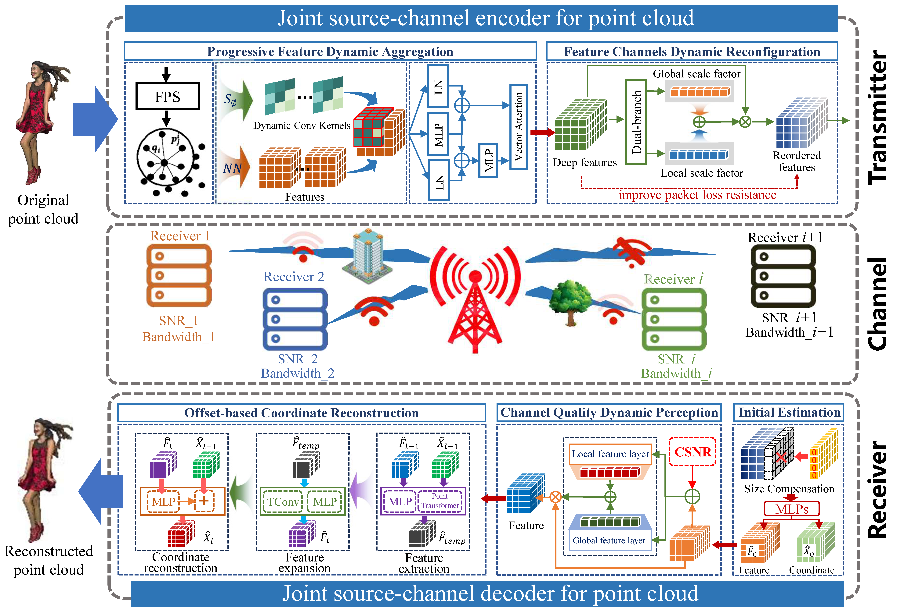

# DAPT: Adaptive Deep Joint Source-Channel Coding for Robust Wireless Point Cloud Transmission
This is the code for paper "DAPT: Adaptive Deep Joint Source-Channel Coding for Robust Wireless Point Cloud Transmission". The model is implemented with PyTorch.

# Abstruct

This paper is dedicated to addressing the critical challenges of point cloud transmission over the wireless channel by proposing an adaptive deep joint source-channel coding method termed DAPT. It constructs an end-to-end coding and transmission framework to support the high-precision real-time interaction and 3D reconstruction for several applications such as Metaverse. Specifically, to handle the high-dimensional and unordered nature of point cloud data, a progressive feature dynamic aggregation mechanism is designed for compact signal representation. To overcome the limitation of insufficient adaptability under dynamic wireless channel conditions, a feature channel dynamic reconfiguration module and a channel quality dynamic perception module are designed, enabling a single neural network model to dynamically adapt to varying transmission bandwidth and channel quality. Furthermore, to mitigate the severe geometric distortion of point clouds caused by the channel noise, a multi-stage offset-based coordinate reconstruction mechanism is proposed, achieving high-quality point cloud reconstruction through progressive refinement from coarse to fine. The extensive experimental results demonstrate that the proposed method significantly improves the efficiency of wireless point cloud transmission compared to the state-of-the-art methods, while exhibiting enhanced robustness and adaptability under varying bandwidth and channel quality.

# Pipline
<div align="center">
  
</div>

# Usage

## Requirements
```bash
git clone https://github.com/llsurreal919/DAPT
pip install -r requirements.txt
```

## Dataset
The training and testing datasets 'ShapeNetCoreV2' can be downloaded from [shapeNet](https://gitcode.com/Open-source-documentation-tutorial/a939f).

## Training
We will release the tutorial soon.

## Testing
The pre-trained model is stored in folder 'Checkpoints'. You can run the test program directly to obtain the same experimental results.
Example usage:
```python
python test_band_and_SNR_adaptive.py
```
# Acknowledgement

The style of coding is borrowed from [SEPT](https://github.com/aprilbian/SEPT) and partially built upon the [PAConv](https://github.com/CVMI-Lab/PAConv). We thank the authors for sharing their codes.

# Contact

If you have any question, please contact me (Junjie Wu) via s210131253@stu.cqupt.edu.cn.